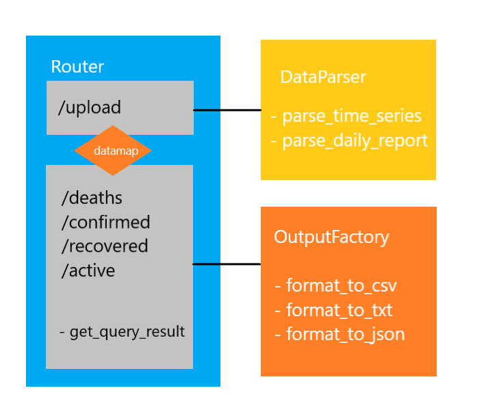

# Intro

A RESTful API interface for the [JHU CSSE COVID-19 Dataset](https://github.com/CSSEGISandData/COVID-19/tree/master/csse_covid_19_data). Users can query data and filter results by specifying URL parameters such as `start`, `end`, `country_region`, and `province_state`. 

Developed using `Flask`.

### Authors

Jefferson Zhong

Helen Zhu


## Table of Contents
   * [Intro](#Intro)
         * [Authors](#authors)
      * [Install](#install)
         * [Prerequisites](#prerequisites)
         * [Running the Code](#running-the-code)
         * [Running Tests](#running-tests)
      * [Usage](#usage)
            * [Sample Call](#sample-call)
         * [URL parameters](#url-parameters)
         * [API](#api)
            * [POST /upload](#post-upload)
            * [GET /deaths](#get-deaths)
            * [GET /recovered](#get-recovered)
            * [GET /confirmed](#get-confirmed)
            * [GET /active](#get-active)
      * [Design](#design)
         * [Relationship Between Objects](#relationship-between-objects)
         * [Design Patterns](#design-patterns)
         * [Function Design](#function-design)
      * [Paired Programming](#paired-programming)
         * [Feature Breakdown](#feature-breakdown)
         * [Paired Programming  Reflection](#paired-programming--reflection)
      * [Code Craftsmanship](#code-craftsmanship)


## Install

### Prerequisites

You must have Python-3 and a package manager [pip] installed on your computer

Additionally, you will need to install the dependencies:

```bash
pip install -r requirements.txt
```
### Running the Code

To start the program, please run the bash command when you are in the *root project directory*.
Note that since the file is very large, so it may take up to 15s to upload the data.

```bash
python3 -m COVIDMonitor.main
```
### Running Tests

To run unit tests with coverage, run the following command:

```bash
pytest --cov-report term --cov=COVIDMonitor tests/unit_tests.py
```


## Usage

endpoint: *localhost:5000*

####  Sample Call
**Format**: `http://<endpoint>/<API Call>?[url parameters]`

```bash
curl http://localhost:5000/deaths?start=01-09-20&end=01-10-2021&country_region=us&province_state=wyoming&output=json
```
- Representing the query that looks for death case records between 2020/01/09 to 2021/01/10 in Wyoming, US and output the result to JSON format.

### URL parameters

- `start`

  The start date of the query in MM-DD-YY format.

  - If `start` is specified without `end`, then the query returns all possible entries with datetime equal to or after `start`.  

  - If both `start` and `end` are not specified, then the query returns all possible entries regardless of date.

- `end`

  The end date of the query in MM-DD-YY format.

  - If `end` is specified without `start`, then the query returns all possible entries with datetime equal or before `end`.

  - If both `start` and `end` are not specified, then the query returns all possible entries regardless of date.

- `country_region`

  The country/region of the query.

  - If `country_region` is not specified, then the query returns all possible entries regardless of country/region.

- `province_state`

  The province/state of the query.

  - If `province_state` is not specified, then the query returns all possible entries regardless of province/state.

- `combined_keys`

  The combined_keys of the query.

  - If `province_state` is not specified, then the query returns all possible entries regardless of province/state.
  
- `output`

  The output format of the query can be one of `json`, `txt`, or `csv`. Defaults to be `txt`.
  
### API

Before sending a query, one must use a browser to visit `http://localhost:5000` to upload at least one data file from the [JHU CSSE COVID-19 Dataset](https://github.com/CSSEGISandData/COVID-19/tree/master/csse_covid_19_data), otherwise, there will be no existing data to query, and a status code `404` along with the message "*Either no data file has been uploaded or query has no match found*" will be returned.

#### `POST` /upload

POST data that user upload and save the file in local path: COVIDMonitor/data. 
This API is triggered when using the upload button to upload file in the browser.

#### `GET` /deaths

Get COVID death case records in the uploaded data set that satisfies the conditions specified in URL parameters. By default, if no URL parameters are given, all death count entries will be returned.

#### `GET` /recovered

Get COVID recovered case records that satisfy the conditions specified in URL parameters. By default, if no URL parameters are given, all recovered count entries will be returned.

#### `GET` /confirmed

Get COVID confirmed case records that satisfy the conditions specified in URL parameters. By default, if no URL parameters are given, all confirmed count entries will be returned.

#### `GET` /active

Get COVID active case records that satisfy the conditions specified in URL parameters. By default, if no URL parameters are given, all active count entries will be returned.


## Design

### Relationship Between Objects



User will first post data files to `/upload`, for which uses the `DataParser` to parse the data file and store entries into `datamap` that acts as an in-memory database for all parsed data.

After `DataParser` updates `datamap`  with data, the service is ready to serve the four `GET` API calls from users. User specifies their query conditions in URL parameters, and `get_query_result()` filters `datamap` and outputs a list of matching entries.

Now with a list of matching entries, the `OutputFactory` generates different formats of response according to the output format specified in the URL parameter. In the end, the formatted response will be returned to the user.  

### Design Patterns

We utilize *Composition Pattern*, *Strategy Pattern*, and *Factory Pattern* along with encapsulation on data entries.

The router(`main.py`) implements a composition pattern using `DataParser` and `OutputFactory`. In this way, we can achieve separation of concern such that the logic of routing, requests, and responses is completely isolated from data manipulation.

On its own, `DataParser` implements a strategy pattern that uses different algorithms to parse time series and daily report data files differently. It is of particular usefulness since time series and daily reports are in a very different format.

The `OutputFactory` implements a factory pattern that generates different types of formatted output according to a different specification. Though different API calls might want different attributes with different output formats, much of the code is shared, a factory pattern that generates output according to different configurations can significantly increase code reusability. It also follows the open-closed principle where the logic of formatting is completely hidden from the router.  

Also, to make data manipulation easier we encapsulate and abstract a generic entry on the data file into a class `DataPoint`. It bundles only the attributes we want, including `datetime`, `country_region`, `province_state`, `admin`, `combined_keys`, `deaths`, `confirmed`, `recovered`, and`active`. Every entry in`datamap` is a list of `DataPoints`.

### Function Design

We define four `GET` APIs for deaths/confirmed/recovered/active and one `POST` API for uploading data. Please see the section [Usage-API](##API) for detailed explanations.


## Paired Programming 
In this assignment, we design the solutions together and paired programmed for most of the features. In the initial meeting, we discuss possible features and decide on a subset of tasks to implement.

### Feature Breakdown
We implement mainly 4 features in the assignment:
- Upload file
  - Front-End UI (Qi Zhu)
  - Routing  (Jefferson Zhong , Qi Zhu)
  - Exception Handle (Jefferson Zhong)
- Parsing Data(Jefferson Zhong,Qi Zhu)
  - DataParser Structure (Jefferson Zhong)
  - DataParser Routing (Jefferson Zhong)
  - DataParser Implementation: (Qi Zhu)
  - DataParser Testing:(Qi Zhu)
- Query Data & Routing (Paired Programmed)
  - Driver:(Jefferson Zhong)
  - Navigator: Qi Zhu
- Output Query & Routing(Paired Programmed)
  - Driver: Qi Zhu
  - Navigator: Jefferson Zhong


### Paired Programming  Reflection
We strictly followed the paired programming requirement in implementing the last two features:1. Query Data & Routing; 2. Output Query & Routing.

We set up an approximate 2 hours limit for each feature. 
Indeed, paired programming profoundly enhanced the efficiency of coding and debugging.  For example, since the feature 'Output Query' is tightly related to Output Query, playing as the navigator of the querying data helped the driver of implementing the next feature in understanding the code more thoroughly.  Additionally, while playing as the navigator for the second feature,  the driver for the first feature, Jefferson, can quickly identify the source of the bug that is caused by his previous implementation.  Switching roles in paired programming contributes to that.

However, paired programming is a bit challenging for teams like us that live in different time zone. It's a little bit hard for us to meet for a long time. We can only break our implementation into several steps and then meet several times to complete a feature. So the gap between the commits in the last feature is a little bit longer compared to other branches.


## Code Craftsmanship
We use VS code built-in python extension IDE pack to format our code.
For paired coding, we use the Live-Share extension in VS code so that we can code at the same time and any live changes will be reflected on both ends.

Also, for naming functions and variables, we strictly follow Python's function naming rules in which we use lowercase with words separated by underscores, e.g. `get_lists()`. Whenever there is a constant involved, we define them at module level with all capital letters and underscores separating each word, e.g. `URL_PARAMS`.

Type annotations in function headers, such as `def func(input: int) -> int`, are used for every function implemented.
